# iOS Weather App

This is a simple SwiftUI app to show current weather and forecasted weather. Please keep in mind the purpose of this isn't to show UI/UX design but rather architecture patterns, data handling, dependency injection, and testing :)

This app uses CoreLocation and MapKit to search for locations. The only SDK brought into the project is the Amplify SDK (and its dependencies) to help showcase the tools that come with the OS. All icons are from SF Symbols.

## Technical Highlights

- **Architecture**: MVVM pattern with SwiftUI
- **Dependency Injection**: Clean separation of concerns with protocol-based services
- **Async/Await**: Modern concurrency patterns throughout the project
- **Core Data Integration**: Efficient caching with background contexts
- **Error Handling**: Graceful fallbacks and user-friendly error states
- **Accessibility**: Full VoiceOver support
- **Dark Mode**: System-wide dark mode support

## Requirements

- Xcode 26.x
- Swift 5
- Minimum iOS: 18.0

## Getting Started

1. Clone the repository
2. Install SwiftFormat: `brew install swiftformat`
3. Install SwiftLint: `brew install swiftlint`
4. Open `Weather.xcodeproj` in Xcode 16+
5. Build and run (Cmd+R)

## Data Fetching

This app uses data from [Open-Meteo](https://open-meteo.com/), an organization providing free weather data at the personal project tier. The data is fetched using the `WeatherService` class which utilizes `URLSession` and `JSONDecoder`.

To see a sample weather response from Open-Meteo like this project uses, enter this call into Postman:

```
https://api.open-meteo.com/v1/forecast?current=temperature_2m,weather_code,apparent_temperature,&daily=temperature_2m_min,temperature_2m_max,weather_code,sunrise,sunset,precipitation_probability_mean,precipitation_sum,uv_index_max,wind_speed_10m_max,wind_direction_10m_dominant,wind_gusts_10m_max&timezone=auto&latitude=40.73&longitude=-73.93&forecast_days=10&hourly=temperature_2m,is_day,weather_code&temperature_unit=fahrenheit
```

The response for each location is cached for 10 minutes using this storage schema:

<p float="left">
    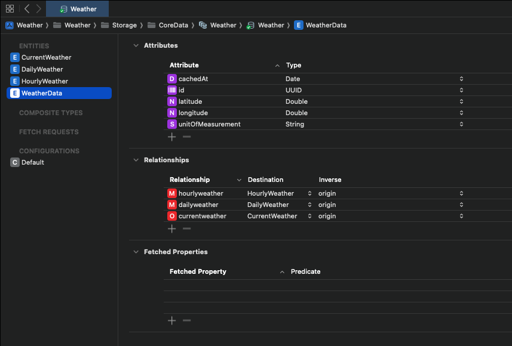
</p>

For more details, see `Weather > Storage > CoreData > WeatherCacheManager.swift` for details.

Here is a screenshot from CoreDataLab showing the stored objects:

<p float="left">
    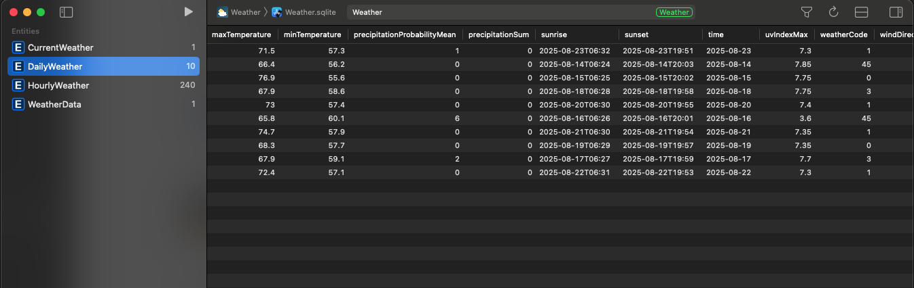
</p>

### Air quality (GraphQL)

Current and forecast air quality on Home and Day Detail come from this AWS AppSync GraphQL api ([aws-weather-service](https://github.com/mjond/aws-weather-service)) which sources its data from [Open-Meteo](https://open-meteo.com/). **Note:** This API isn't always deployed, so you may see a "data not available" message for the air quality view.

The app uses the **Amplify Swift** libraries with **IAM**-signed requests (`AirQualityService` and the `GetAirQuality` operation). Query documents and the local schema live under `Weather/Service/AirQuality/`.

### Setting up GraphQL

Local config files are gitignored; the Xcode **Ensure Local Config** run script copies the examples on first build if the real files are missing. Setting up the GraphQL API call isn't necessary to run the app. Without this, the air quality section will simply show an error.

1. Build once in Xcode (or manually copy `Weather/Service/Config/amplifyconfiguration.example.json` → `amplifyconfiguration.json`, and `AppConfig.example.xcconfig` → `AppConfig.xcconfig` in the same folder).
2. Edit **`Weather/Service/Config/amplifyconfiguration.json`**: set the AppSync **GraphQL endpoint** and **region** for the `WeatherAPI` entry, and set the **Cognito Identity Pool** (`CredentialsProvider` → `CognitoIdentity` → `PoolId`) so the app can obtain guest IAM credentials for signing.
3. Edit **`Weather/Service/Config/AppConfig.xcconfig`** so `APPSYNC_GRAPHQL_URL`, `APPSYNC_REGION`, `APPSYNC_IDENTITY_POOL_ID`, and `APPSYNC_AUTH_MODE` match the same backend.
4. Clean build and run. If your AppSync schema does not match this repo’s, update the `.graphql` files under `Weather/Service/AirQuality/` and the generated selection types in `AirQualityGeneratedSchema.swift` accordingly.

## Navigation

This app uses `NavigationStack` with `NavigationPath` for navigation. See `NavigationStateManager.swift`.

## Features

### Home

This is the main view of the application. It displays the current weather, 24 hourly forecase, and 10 day forcast. This view defaults to the user's current location.

<p float="left">
    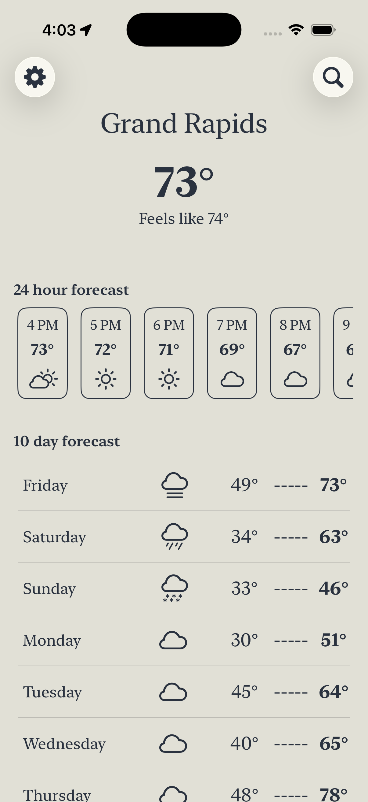
    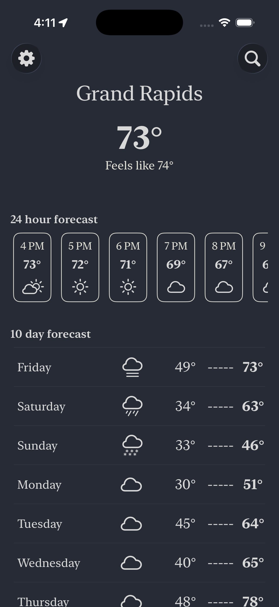
</p>

<p float="left">
    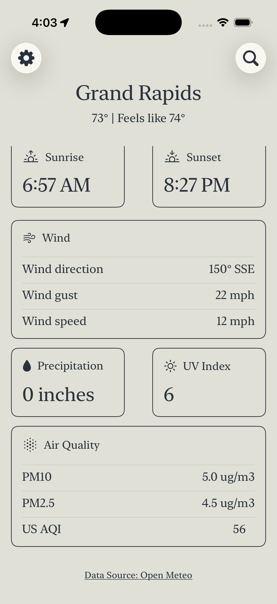
    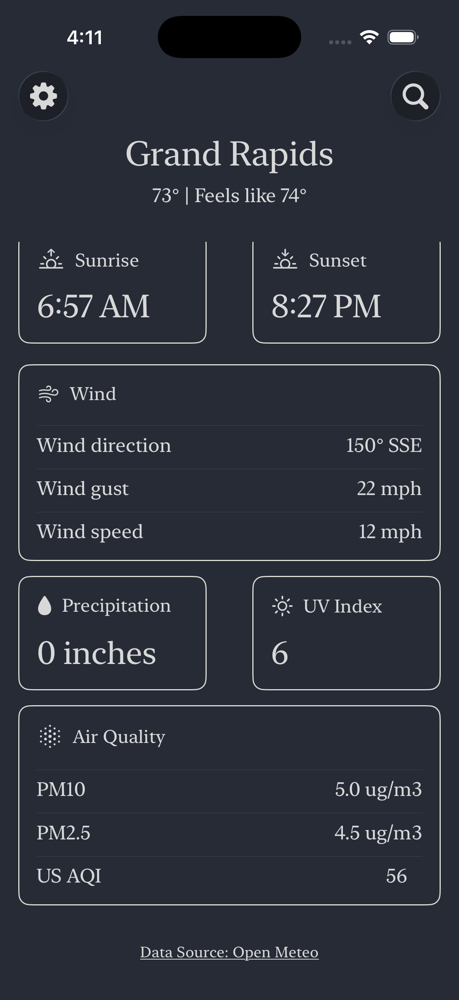
</p>

### Day Detail

Tapping on a day from the Home screen will bring the user to the Day Detail View.

<p float="left">
    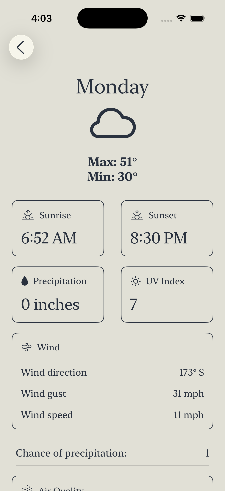
    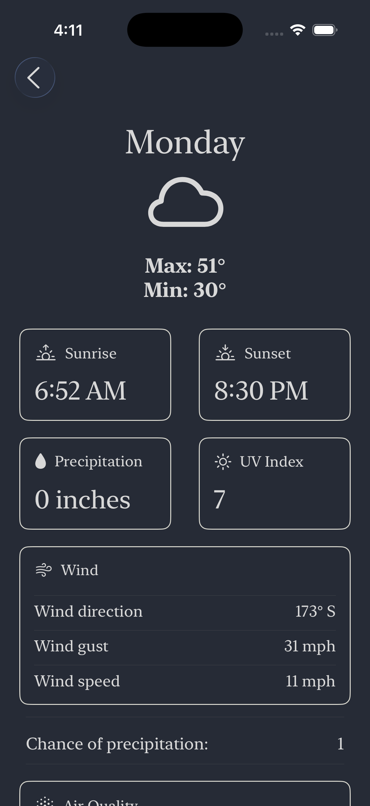
</p>

<p float="left">
    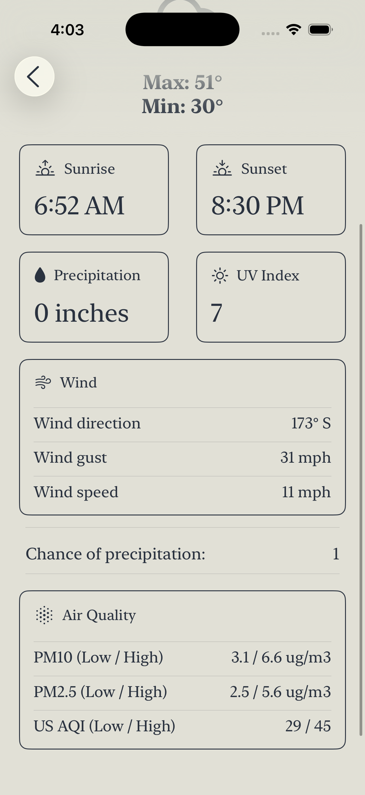
    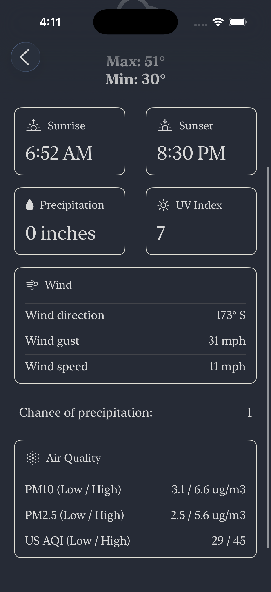
</p>

### Location Search

Tapping on the magnifying glass icon from the Home screen's navigation bar will bring the user here. This view utilizes the `MKLocalSearchCompleter` from MapKit to search for locations.

<p float="left">
    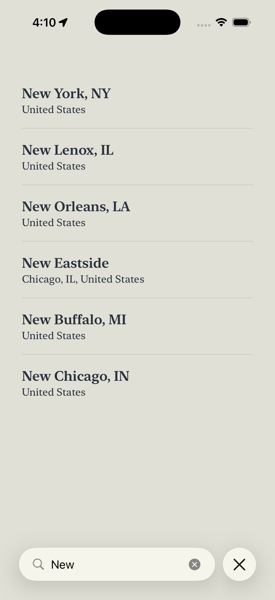
    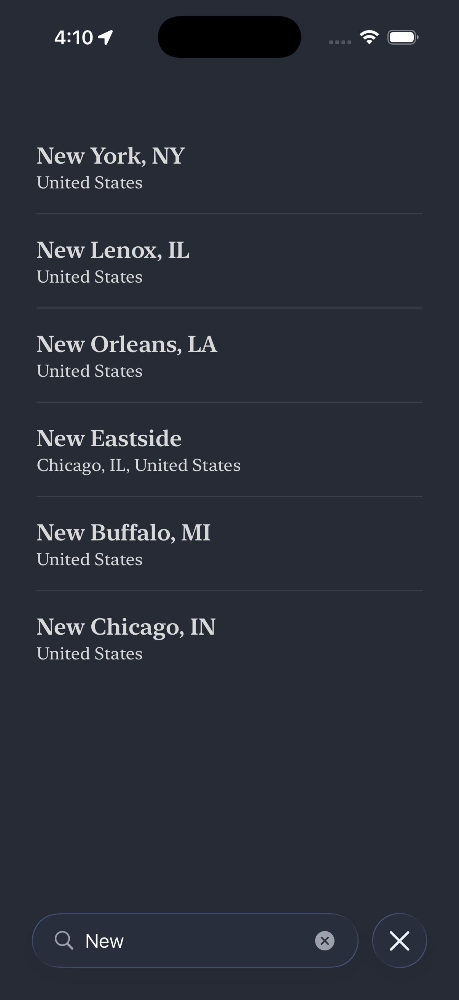
</p>

### Settings

Tapping on the gear icon from the Home screen's navigation bar will bring the user to Settings where the user can change between Imperial and Metric.

<p float="left">
    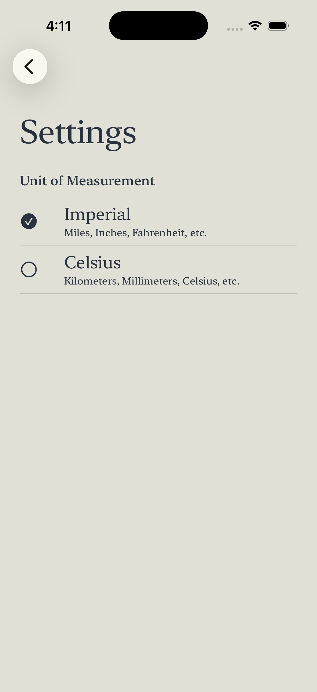
    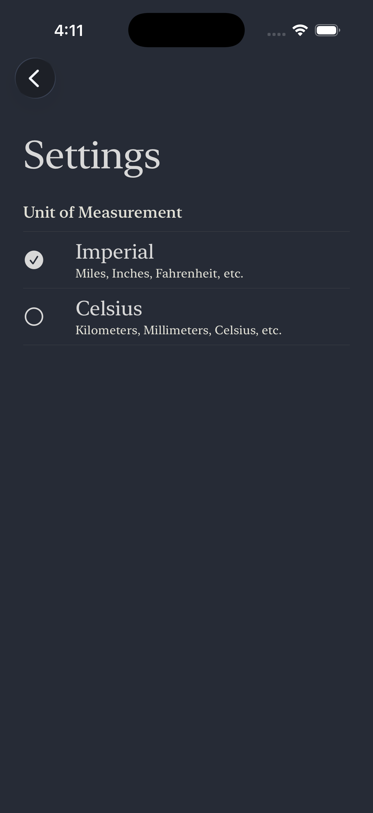
</p>

### Location

If a user denies location services, or turns it off at a later time, then the user is prompted to allow location services.

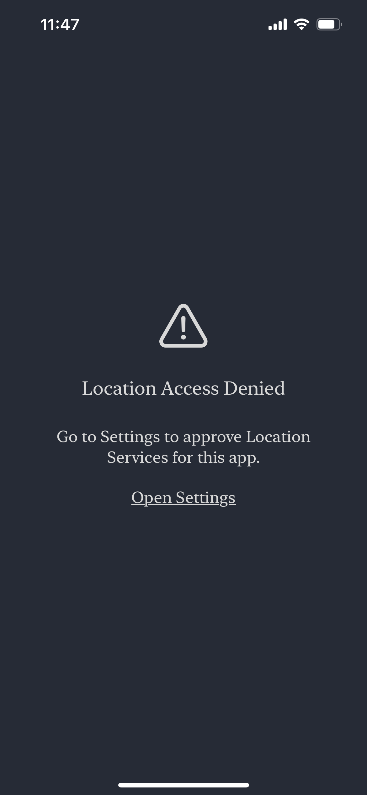

## Unit Testing

Coverage is currently at 70%. The tests focus on the data models, services, and view models. See `WeatherTests/` for details.
