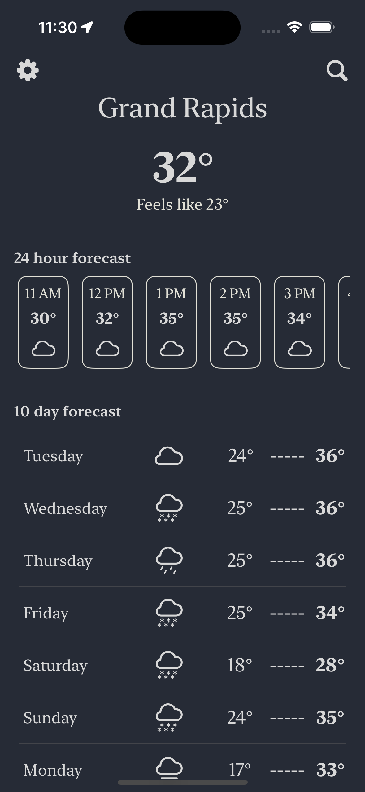
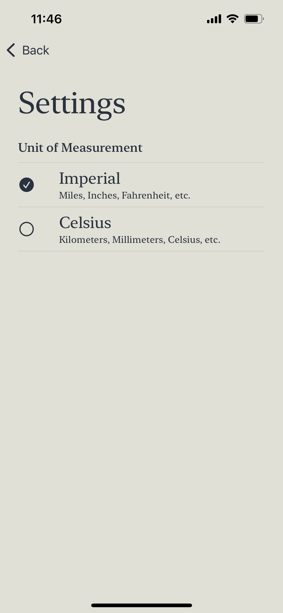

# iOS Weather App

This is a sample SwiftUI app to showcase API fetching, parsing the data, and then displaying the data to the user. This project uses an MVVM architecture.

This app uses Core Location and MapKit to search for locations. No third-party SDKs are used in this project to showcase using what comes with the phone. All icons are from SF Symbols and dark mode is supported. Voice Over accessibility is supported.

## Requirements
- Xcode 16.x
- Swift 5
- Minimum iOS: 17.0

## Data Fetching
This app uses data from [Open-Meteo](https://open-meteo.com/), an organization giving free weather data at the personal project tier. The data is fetched using the `WeatherService` class which utilizes `URLSession` and `JSONDecoder`.

## Navigation

This app uses `NavigationStack` with `NavigationPath` for navigation.

## Features

### Home
This is the main view of the application. It displays the current weather, 24 hourly forecase, and 10 day forcast.

### Day Detail
Tapping on a day from the Home screen will bring the user to the Day Detail View.

### Location Search
Tapping on the magnifying glass icon from the Home screen's navigation bar will bring the user here. This view utilizes the `MKLocalSearchCompleter` from MapKit to search for locations.

### Settings
Tapping on the gear icon from the Home screen's navigation bar will bring the user to Settings where the user can change between Imperial and Metric.

### Location
If a user denies location services, or turns it off at a later time, then the user is prompted to turn location services back on.

